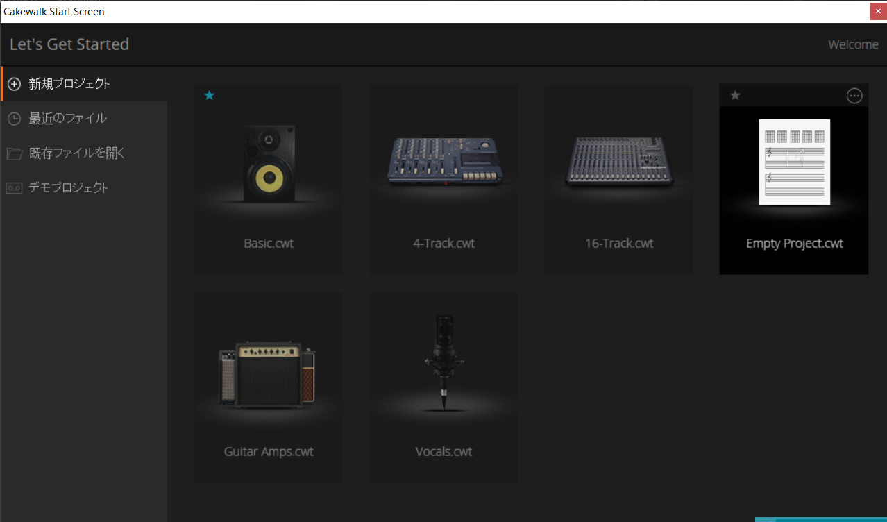
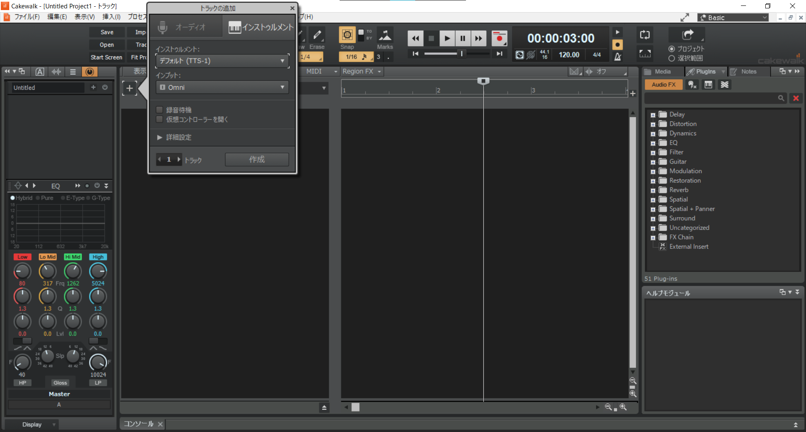
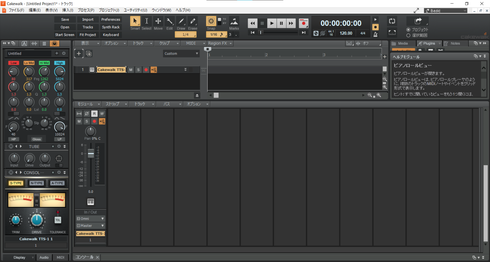
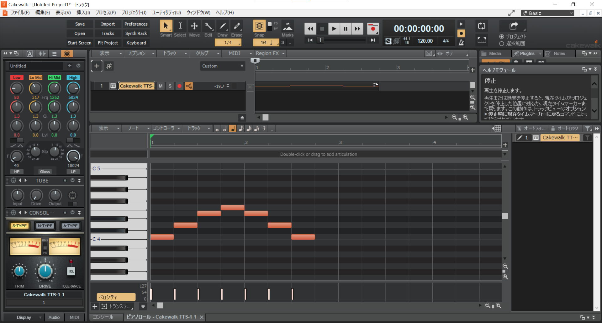
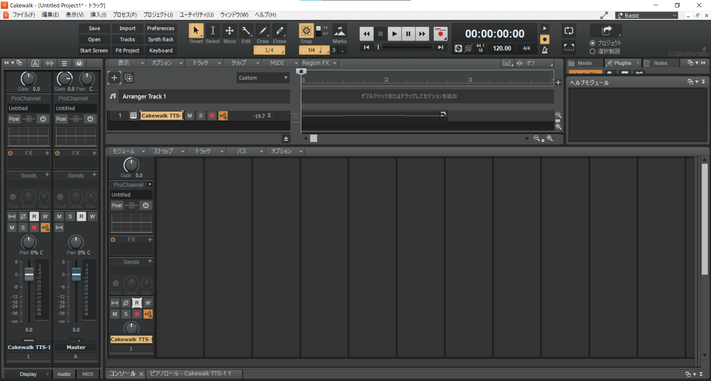

# CCS DTM講座'21 第1回

## DAWとは何か

DAW(Digital Audio Workstation)は、大まかにいうと作編曲のためのソフトです。ミックスやマスタリング、生楽器の録音までできます。  
いろいろな種類のソフトウェアが発売されており、気に入ったものを使うとよいです。(ここでは私がCakewalkを使っているので、Cakewalkを使っている前提で話を進めます)

### いろいろなDAW

1. Cakewalk  
	私たちが使うやつです。もともと有料だっただけあってかなり多機能です。(バグも多いです)	
1. Studio One  
	これも無料版であるPrimeの評価が高いです。操作性がいいとか。デフォルトの音源が貧弱らしいです。
1. FL Studio  
	ダンスミュージックといえばコレ！ってDAWです。繰り返し系にめっぽう強いです。
1. Cubase  
	これも安定して高い評価を受けています。アーティストが使っていがち。

おすすめは特にありません。無料なのでCakewalkはとりあえず薦めますが。  
作りたい曲のジャンルや、お気に入りのアーティストが使っているかどうかで決めてもいいと思います。

## DAWに触れる

起動してみましょう。ダブルクリック！

こんな感じの画面が出てきたと思います。Empty Projectをクリックです。そのあとは+をクリックです。

インストゥルメントはTTS-1に設定しましょう。ピアノです。(楽器はvstという共通規格によります)

この、なんか右側の細長い枠を右クリックして「表示」→「ピアノロールビュー」をクリックすると、なんと鍵盤が出てきます。適当にクリックして音を鳴らしてみよう！長さはドラッグしたりすると変わりますが、snapと書いてある下の数字やまたその横の数字を適当にいじってみましょう。

(細かい話をすると、ノートはMIDIと呼ばれる形式に沿って発音されます。ある程度は話しますが、詳しくは検索してください)

### 打ち込み！

何はともあれ、実際に楽曲を打ち込んでみましょう。課題曲は『亡き王女の為のセプテット』です。  
[ここ](https://easypianoscore.jp/sheetList.php?titleid=kouma)の13番目のやつです。楽譜をダウンロードして、1~18小節目まで打ち込んでみましょう。

### よくある質問
* 調がわかりません！  
	調号(ト音記号とかヘ音記号とか)の横についている♯や♭は、「五線譜でその高さに対応する音(とそのオクターブ違い)を半音上げる/下げる」という意味です。 
	たとえばこの曲では、♯がド、ファのところにあるので、ドとファは半音上げて入力してください。(みんな知ってるらしい？)

### 曲を書き出す前に
完成しましたか？してもしなくてもとりあえず、曲を書き出してみましょう。でもその前に。  
作曲者にとって、**音割れは天敵**です。ですから、音割れさせない方法を(簡易的にですが)学びましょう。
まず、左上で光ってるメーターみたいなボタンをクリックして消灯させます。(そのまた左にある左矢印みたいなのでもいいです)すると、なんか出てきます。

この画像の左側、Masterと書いてあるやつのゲージが赤くならないようにするのが肝要です。  
満たすべき条件は
* Masterのゲージが赤くならない(0.0dbを超えない)
* 楽器どうしのバランスが悪くならない(これは今ピアノしかないのであんまり関係ないですが)

です。この条件を守って、**各楽器の**音量のつまみ(フェーダーといいます)をいじりましょう。Masterをいじるのはだめです。

### 曲を書き出す
ここからは簡単です。

のように、小節数が書いてある部分を適当にドラッグして、書き出す範囲を選択します。このときに注意ですが、終端は音符が無くなるちょうどではなくて、1~2小節開けた部分に設定します。そうしないと最後の音が途切れて悲しくなります。  
選択したら、メニューから「ファイル」→「エクスポート」→「オーディオ」。オプションはいじらず、ファイル名と出力形式、場所を選んでエクスポートをクリックです。

## おわりに
お疲れ様でした。これであなたたちもDTMerの仲間入りです！……とはいえコードも何も知らないのでは作曲はしんどいので、次回からはもっと理論的な部分をぼちぼちやっていこうと思います。今回の宿題はありません。モチベのある人はまあ適当にピアノロールぽちぽちしてみましょう。