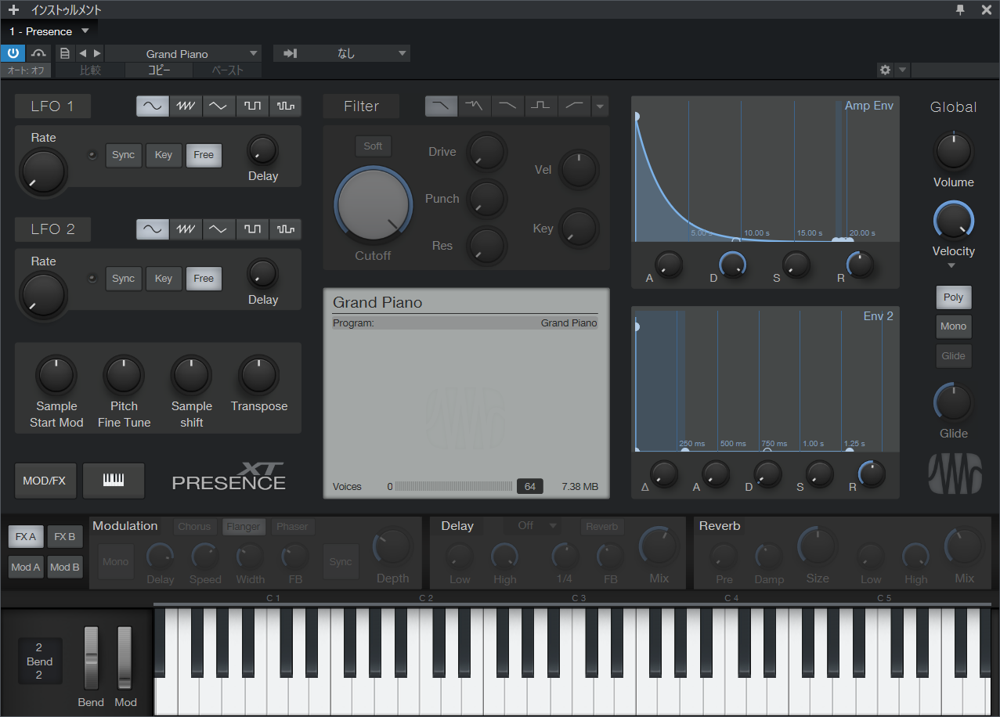
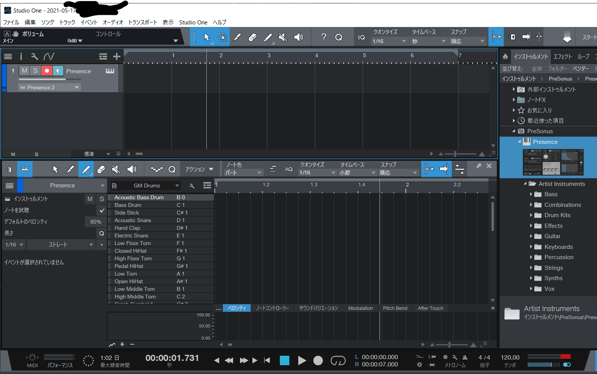
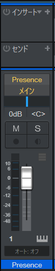

<!-- omit in toc -->
# CCS DTM講座'21 第4回
<!-- omit in toc -->
* [4.3.1 DAWの使い方](#431-dawの使い方)
* [4.4.1 パンニング](#441-パンニング)
### 4.3.1 DAWの使い方
  
の画面を開いて、Grand Pianoを「Drum kits」→「Basic kit」に変更してください。
  
ピアノロールの左上にピアノの鍵盤のアイコンが青く光っている部分があるので、その隣のドラムを選択してください。ドラムモードになります。ピアノロールに「Presence」と書いてある部分がありますが、その右に謎の空欄(画像参照)があるので、クリックして「GM Drums」を選択してください。  
クリックで音符を置いて、もう一度クリックすると音符が消せます。

### 4.4.1 パンニング
  
第一回の時と同じように、「ミックス」をクリックすると画像のやつが出てきます。Studio Oneではパンニングはこの青い棒を左右に移動させることで行います。