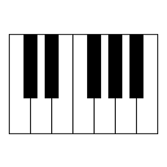

# CCS DTM講座'21 第1回

## 音楽理論基礎3(その他)

ここでは前回やらなかったコードの続きをちょっとだけ説明します。(あんまり深入りするとそれだけで大変なことになってしまうので……)
## セブンスコード
前回は三和音の話をしましたが、今回は四和音、とりわけセブンスコードの話をします。セブンスコードはとにかく**エモい**です。が、やや複雑でもあります。度数の話を思い出しながら読んでください。

### 前準備  

出典: [アイキャッチャー](https://ai-catcher.com/)  
これまでは〇度という言い方をしてきました。厳密には正しくないときもあって、そういう時には短〇度、長〇度などという呼び方をします。鍵盤で確認します。  
ドの三度上の音はミです。ミの三度上の音はソです。  
では、ドとミは鍵盤何個分(つまり、半音にして何個分)離れているでしょう？4つですね。では、ミとソは鍵盤何個分離れているでしょう？3つですね。同じ度数なのに、音の間隔が違います。これはちょっと困ってしまいますね。

混同を防ぐために、半音3つ離れた音のことを短三度、4つ離れた音のことを長三度と呼びます。n(n=2,3,5,7)度の音に対して、半音の間隔が小さいn度を短n度、大きいn度を長n度と呼びます。半音の間隔に直すと理解しやすいですが、時間はかかります。(他は完全m度、増/減m度などと呼びます。詳しくは調べてみてください)

### セブンスコードのバリエーション
セブンスコードはその名の通り、セブンス(七度)の音を三和音に重ねて作ります。今述べた通り、七度の音には短七度、長七度の音があります。一方三和音も、短三度(4番目)を入れるか、長三度(5番目)を入れるかでマイナーかメジャーかに分かれます。よって、三度の長短と七度の長短で4種類のセブンスコードが生まれます。
各コードをピアノロールで紹介しておきます。

* メジャーセブンス  
一小節目の和音です。メジャーコード+長七度。
* セブンス(ドミナントセブンスともいいます)  
二小節目の和音です。メジャーコード+短七度。
* マイナーメジャーセブンス  
三小節目の和音です。マイナーコード+長七度。  
* マイナーセブンス  
四小節目の和音です。マイナーコード+短七度。

お分かりいただけたと思いますが、長七度を重ねると「メジャーセブンス」が、短七度を重ねると「セブンス」がコード名につきます。それぞれ略してΔ7、7などと書きます。

## ボイシングとコードの転回
前回の作曲前に、「コードはある音をオクターブ上げ下げしてもこわれない」という話をしました。今回は詳しくコードの転回の話をします。

### ボイシング
コード進行を打ち込んでいくときに考慮しなければならない点として、「コード全体の音の上下の激しさ」があります。ベースはメロディの引き立て役なので、メロディを食ってしまうような激しい音の上下は好ましくありません。  
ですから、「コードは構成音さえ合っていれば問題なく聞こえる」という性質を使って、コードを構成する音をオクターブ単位で上下させていきます。コードにある音だったら、「全部の五度をオク下でも鳴らす」みたいなことをしてもいいです。(低音はあんまり詰めすぎても聞こえないんですけど……)

このようにしてコードを構成音ごとにばらばらに置いていくことをボイシングといいます。構成音が1オクターブに収まらないときはオープンボイシング、収まるときはクローズドボイシングといいます。  
オープンボイシングの和音からは柔らかい印象を、逆にクローズドボイシングの和音からは硬い印象を受けます。(というのが痛切ですが、筆者はよくわかっていません)

### コードの転回
転回の定義についてはかなり各サイトによって言っていることが違って困るんですけど、ここでは[SoundQuest](https://soundquest.jp/quest/chord/chord-mv3/slash-chord-1/)の言っていることを信じて説明します。  
まず、コードの転回はボイシングの一種です。「音(ここでは特に左手の音)の移動を滑らかにする」という目的も同じです。  
前回、「ルート音はオクターブを下げて鳴らすと厚みが出てよい」という話をしました。実はこのオクターブ下で鳴らす音は、ルート音以外も許されています。すなわち、「左手で弾く音はコードの構成音ならなんでもいい」というのが転回という言葉が意味するところなのです。

## リズム隊作成
私たちは今まで、メロディ、ベースを作りました。あとはドラムがあればとりあえず曲として完成するはずです。最後の一息、がんばりましょう。

### DAWの使い方
ドラムは「ある特定の音階の音を鳴らす」楽器ではないので、ふつうはピアノロールで打ち込んだりはしません。じゃあどうやって打ち込むのかというと、リズム隊専用の打ち込み画面があります。  
楽器にSI-Drumを選択。ピアノロールを表示する要領で選んでいくと、「ステップシーケンサ」というのが見つかると思います。クリック！

こんな感じの画面が開かれます。設定の説明をします。左上のBeatsは1ループの小節数を示しています。Stepsは1小節内の拍数を示しています。Stepsは4の倍数にしておくといいと思います。クリックで音が置けて、右クリックで削除できます。よくあるリズムパターンを例にとって、打ち込みの練習をしてみましょう。

* 四つ打ち  
ダンスミュージックによく使われているやつです。バスが4分の間隔で鳴って、2、4拍目にスネアが、裏打ちでハイハットが鳴ります。(行の名前は右クリックで変更できます。)

* 8ビート  
ポップスでめちゃめちゃ使われているやつです。バスとスネアは四つ打ちと同じですが、ハイハットが8分の間隔で鳴ります。これが名前の由来です。

* 16ビート  
これもポップスやロックでよく使われているやつです。バスとスネアは**基本的に**8ビートと同じで、ハイハットが16分の間隔で鳴ります。これが名前の由来です。

ところで、2小節の頭と4小節の頭にハイハットがありません。これは実際にドラムを叩くことを考えてみるとわかるのですが、16分の間隔でハイハットを叩くのには多くの場合両手が必要で、スネアを同時に叩けないからです。(もちろんテンポが遅い場合はその限りではありません。)

### グルーヴ感を生み出す
今まで打ち込んだドラムはどうも機械的で、ノリが悪い感じがします。ちょっとしたアレンジで自然な感じにしてみましょう。

この画像を参考に、二点ほど紹介しておこうと思います。  
1. 音量を調整する  
いつも一定の音量で音が鳴るのは不自然なので、音量にばらつきを持たせます。特にハイハットはこの調整が重要です。基本的には、「(表拍の音量)>(裏拍の音量)」となるように調整しておけば大丈夫です。
1.  キックのリズムをアレンジする  
これはやや応用的で、また生音系の音楽に対して有効です。(電子音楽はふつうに四つ打ちしとけば大体何とかなります)具体的にと言われると困るんですが、聴いたことある感じにキックのリズムをいじるとよいです。16分のリズムで入れるのが効きます。